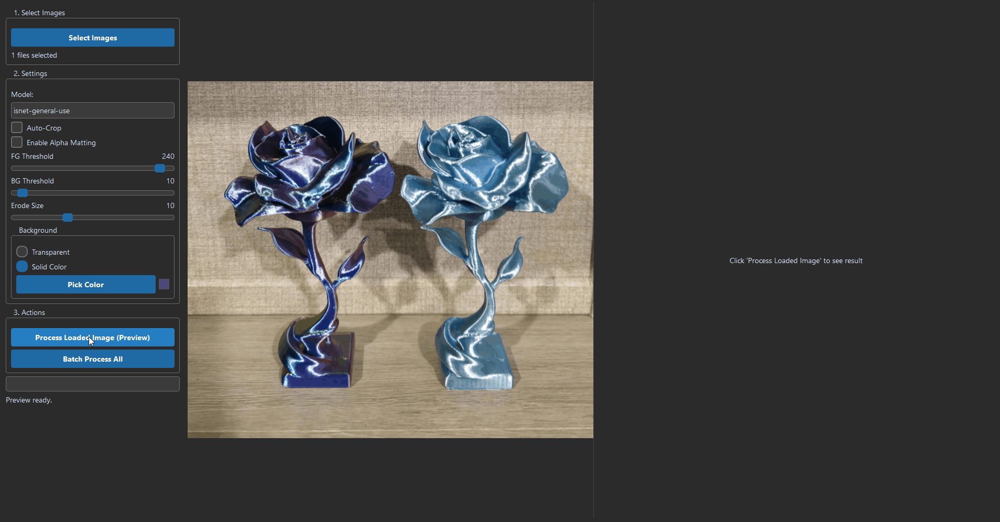
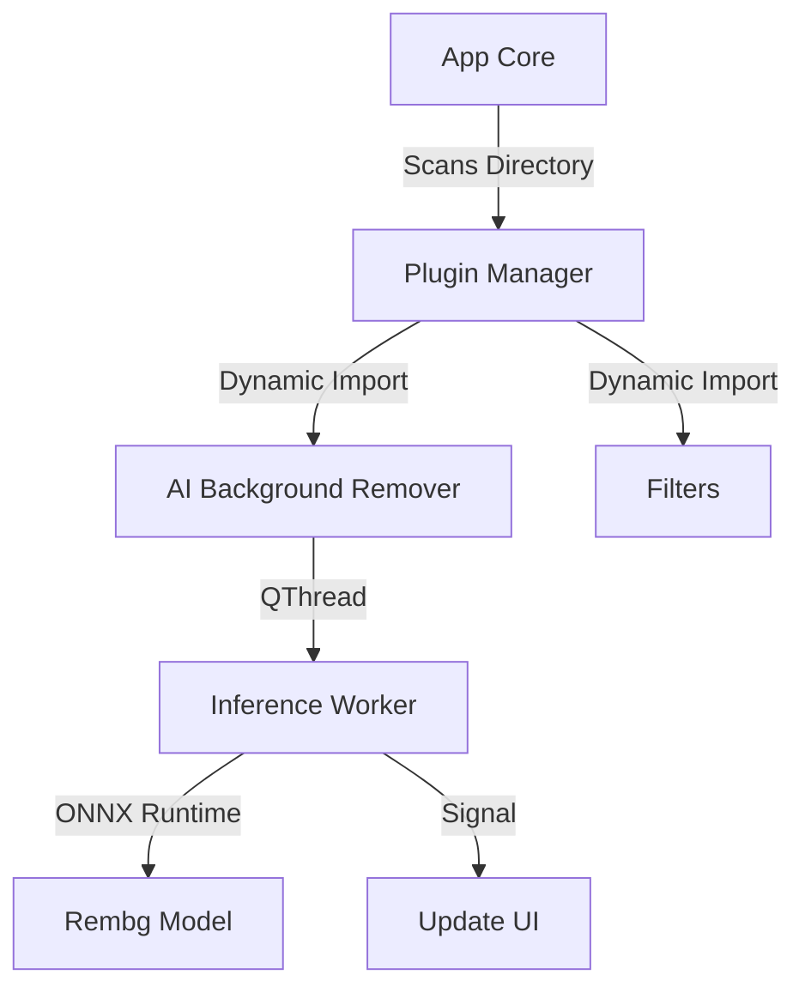

# Smart Image Editor


> **A Modular, Plugin-Based Architecture for Batch Image Processing.**

---

## 📸 Demo



---

## 💼 The Challenge

As the requirements for image processing tools grew (background removal, color correction, resizing), adding features to a monolithic codebase became unmanageable. I needed an architecture that was scalable, where new tools could be added without risking stability in the core application.

## 🛠️ The Solution

I engineered the *Smart Image Editor* with a strict **Plugin-Based Architecture**. The core application is a lightweight shell that handles the GUI window and file I/O. All actual image processing logic (like the AI background remover or color filters) exists as standalone Python modules in a `plugins/` directory.

* **Dynamic Loading:** On startup, the `PluginManager` scans the directory, inspects the Python files using `importlib`, and dynamically builds the menu system based on the available plugins.
* **Non-Blocking Batch Processing:** The "AI Background Removal" plugin runs deep learning inference. To prevent the UI from freezing during large batches, I implemented a QThread worker pattern that offloads the heavy lifting to a background thread while updating the main UI progress bar.

---

## 🚀 Technical Highlights (The "Secret Sauce")

**The Plugin Manager**
The `PluginManager` class uses Python's `inspect` module to verify that loaded scripts adhere to the `PluginInterface` abstract base class. This ensures type safety and prevents the application from crashing if a malformed plugin is added. It essentially allows the application to be "hot-extended" by simply dropping a new script into a folder.

### Key Code Snippet

```python
# Dynamic Plugin Loading Logic
class PluginManager:
    def load_plugins(self):
        plugins_dir = "plugins"
        for filename in os.listdir(plugins_dir):
            if filename.endswith("_plugin.py"):
                module_name = filename[:-3]
                module = importlib.import_module(f"plugins.{module_name}")
                
                # Verify compliance with Interface using inspect
                for name, obj in inspect.getmembers(module):
                    if issubclass(obj, plugin_interface.Plugin):
                        self.plugins.append(obj(self.main_window))
```

---

## 🏗️ Architecture & Tech Stack

This application was built to be scalable and maintainable using the following technologies:

| Category | Technologies |
|----------|-------------|
| **Core** | Python, PySide6 |
| **Architecture** | Dynamic Plugin System (Strategy Pattern) |
| **AI Inference** | Rembg (Background Removal), ONNX Runtime |
| **Data** | NumPy, Pillow |

### Plugin System Architecture


---

## 🔐 Licensing & Access

This software is a proprietary commercial product.

**Availability:**
* **Source Code:** Closed Source (Private Repository)
* **Licensing:** Single-user and Enterprise licenses available.
* **Customization:** Plugin development services available on request.

If you are interested in using this framework for your own image processing needs, please contact me.

---

## 📬 Contact

**Aaron** *Operations Manager turned Python Developer* Looking to automate your business operations?  
[View Portfolio Website](https://bearded1derer.github.io/) | [Connect on LinkedIn](https://www.linkedin.com/in/aaron-arpin-979a1354/)
